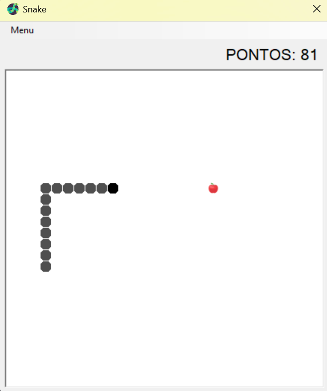

# Snake Game WinForms

Snake game with a graphical interface in C# and Windows Forms, developed in 2025 as a personal project while following a YouTube tutorial.



## Features

- Graphical interface and components rendered in a Windows Forms window
- Snake movement with keyboard controls
- Food spawning and snake growth
- Score tracking
- Game over detection

## Getting started

Requirements: Windows and Visual Studio with the **.NET desktop development** workload (the .NET Framework 4.7.2 targeting pack).

```bash
git clone https://github.com/bobencke/snake-game-winforms.git
cd snake-game-winforms
```

Open the `.sln` file in Visual Studio and press **F5** to run.

## Credits

The game logic and assets come from the [Programação Avançada snake game tutorial video](https://www.youtube.com/watch?v=_CgYg6JgdvQ) on YouTube.

## Technologies

- C#
- Windows Forms
- .NET Framework 4.7.2